# Steeler Voices

A Community Voices Document for **r/steelers**: what the community talked
about this week and what it will talk about next week, written by a local
model with retrieval over the week's own voices — and, side by side, by the
same model without retrieval, so the two can be compared.

Built for the Transcendent Endeavors code challenge (Summer 2026).

## What it looks like

The week of September 15, 2026, as the stack shows it after `make dev`.

<table>
<tr>
<td width="50%">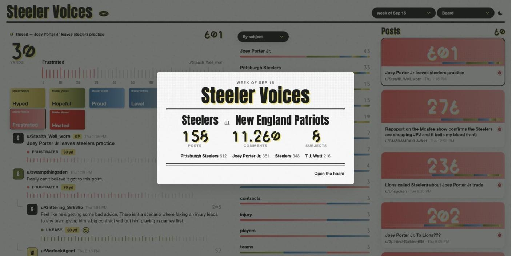<br><sub><b>The flyer.</b> The week's program cover opens over the board: the matchup from the schedule pipeline, the counts, the top subjects. "Open the board" closes it; the football brings it back.</sub></td>
<td width="50%">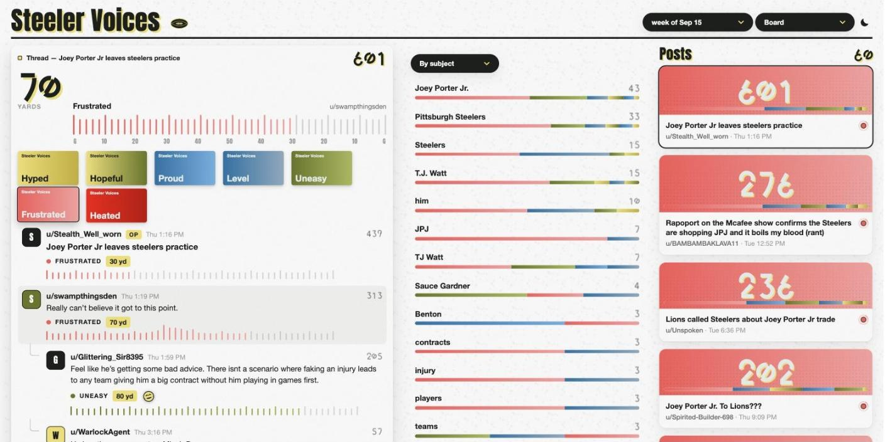<br><sub><b>The board.</b> Every voice is read in yards of mood on a 100-yard pulse. The scoreboard rests on the post and plays whatever you hover — here u/swampthingsden at 70 yards, Frustrated.</sub></td>
</tr>
<tr>
<td>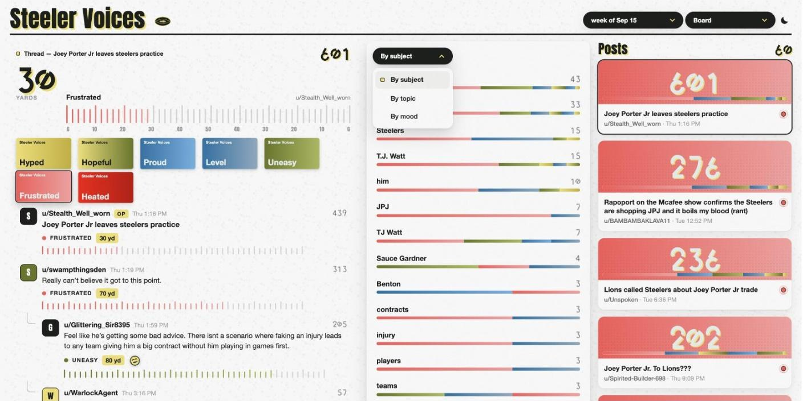<br><sub><b>The readings pane</b> groups the thread's voices by subject, topic or mood, each row with a count and its mood mix. Pressing a row keeps only its voices in the thread.</sub></td>
<td>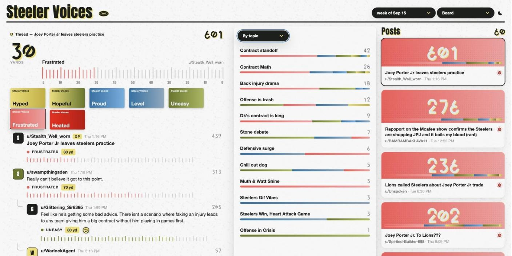<br><sub><b>By topic.</b> The same thread by the week's clustered topics — "Contract standoff", "Contract Math", "Back injury drama" — named by the model from the vectors.</sub></td>
</tr>
<tr>
<td>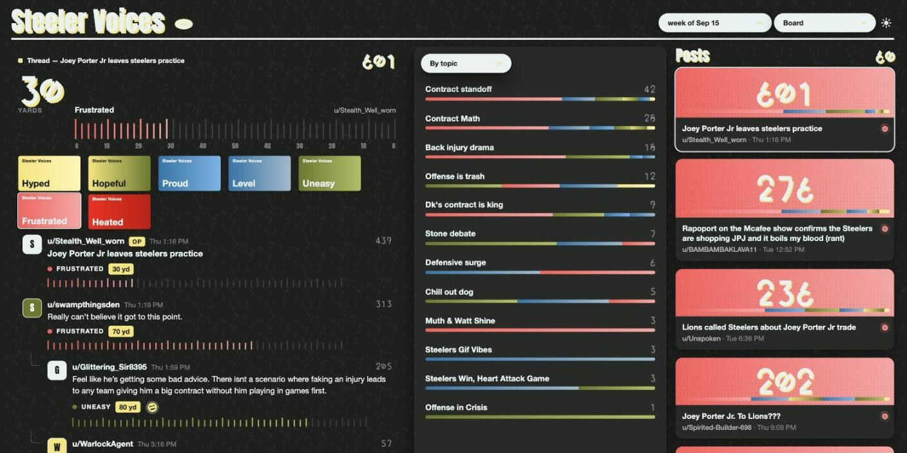<br><sub><b>The dark ground.</b> One icon switches it; every token has a value for both grounds, the mood gradients included.</sub></td>
<td>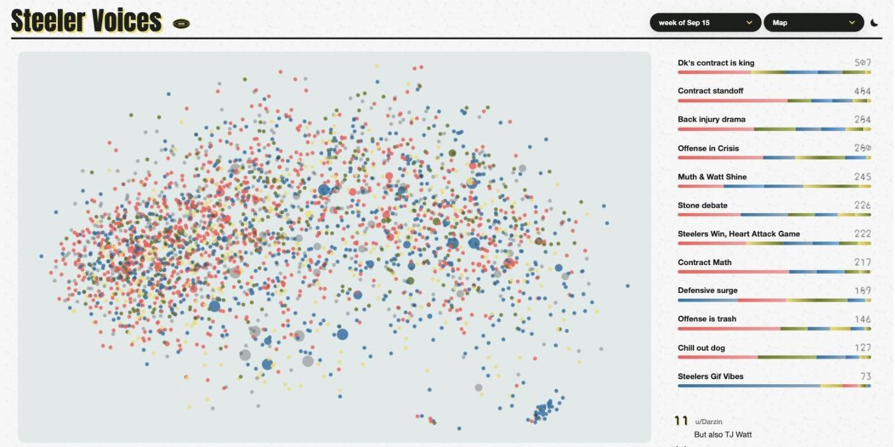<br><sub><b>The map.</b> 18,000 embeddings projected to two dimensions, colored by mood, each dot sized by how often the generator retrieved it. The week's topics beside it; the most-retrieved voices below.</sub></td>
</tr>
<tr>
<td>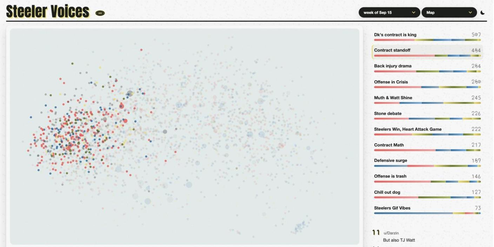<br><sub><b>A topic pressed</b> keeps its dots and fades the rest — "Contract standoff" is a region.</sub></td>
<td>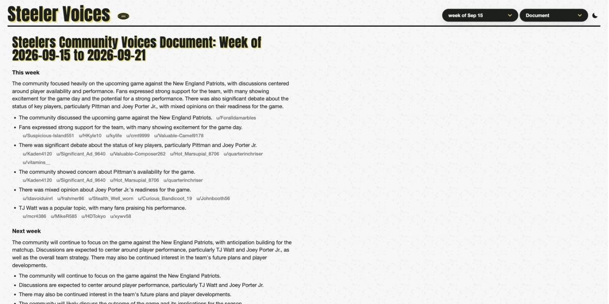<br><sub><b>The document.</b> This week and next week, written by the model with retrieval over the week's voices. Every claim is one sentence with the fans who said it beside it.</sub></td>
</tr>
<tr>
<td>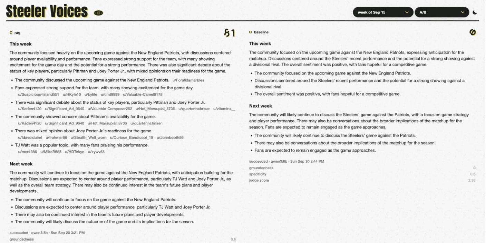<br><sub><b>The A/B.</b> The same model, the same brief, the same judge: with retrieval on the left (81 retrievals, groundedness 0.6, judge 3.4) and without on the right (0, judge 2.3 — and "a divisional rival").</sub></td>
<td>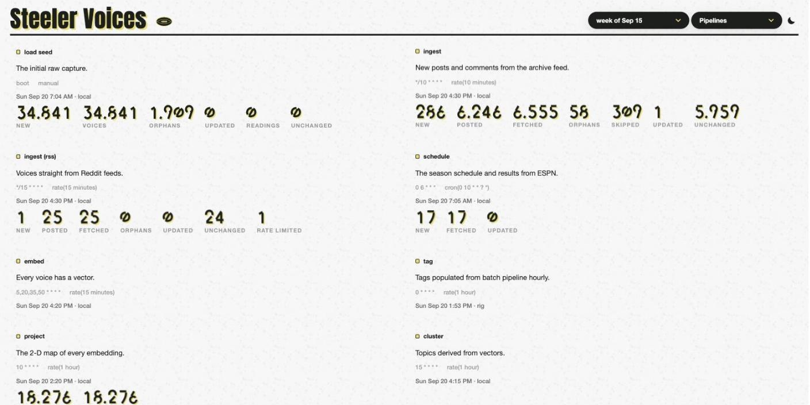<br><sub><b>The pipelines.</b> Every pipeline that fills the store, its local and remote schedules, and its last run's counts, drawn.</sub></td>
</tr>
<tr>
<td colspan="2">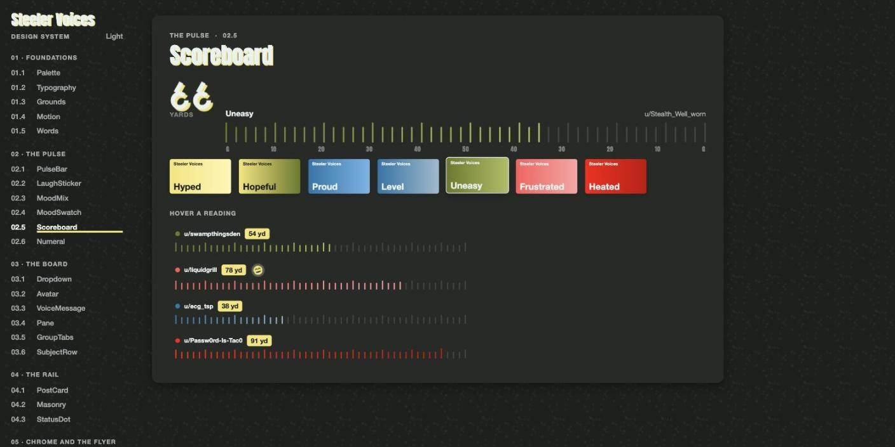<br><sub><b>The design system,</b> read as a book on its own URL. Twenty-eight primitives, each a plate; the app composes them over Module Federation and draws nothing of its own.</sub></td>
</tr>
</table>

## Run it

You need Docker Desktop (Compose v2). Then:

```bash
git clone <this repo> && cd te-takehome
make dev
```

| what | where |
|---|---|
| the app | http://localhost:5300 |
| the design system's manual | http://localhost:5301 |
| the API | http://localhost:8300/api/status/ |

On first boot the pipelines load the committed seed — six weeks of
r/steelers, 34,841 voices — into Postgres, then embed, tag, project and
cluster them on their schedules while the stack is up. The board is full
within a minute; the moods, the map and the topics fill in behind it.

**The model.** Everything runs on Ollama, locally, no keys. On a Mac,
install [Ollama](https://ollama.com) and pull the two models — the host's
Ollama uses the GPU, a container cannot:

```bash
ollama pull qwen3:8b && ollama pull qwen3:4b-instruct
```

On a machine without Ollama, `COMPOSE_PROFILES=bundled-ollama make dev`
runs it in a container (CPU only — slower, nothing to install).

**The document.** The generator writes each week on Tuesday morning; to
write one now:

```bash
make generate WEEK=2026-09-15          # both arms; a few minutes on a GPU, longer on a CPU
```

Then open the app's **Document** and **A/B** sections. `OLLAMA_BASE_URL`
may point at a remote Ollama (see `infra/rig/`) for both `make dev` and
`make generate`.

The long form — every prerequisite, every environment variable
(`.env.example`), what fills in when, and what to do if something's off —
is `SETUP.md`.

## How it answers the challenge

| asked | here |
|---|---|
| A community with a daily online presence | r/steelers — every post and comment, read from a public archive and from reddit.com's own feeds, no credentials |
| A Community Voices Document: this week, and next week | `voices-be/documents/` — one LangGraph graph writes it; the app's **Document** section shows it, with every claim's citations back to the community |
| RAG over a vector store | pgvector (`VectorField`, HNSW, cosine) in the one Postgres; queries embedded with the same 384-d model the pipelines used |
| A flattened visualization of the embeddings | the **Map** section — every voice projected to 2-D (PCA), colored by mood, sized by how often the generator retrieved it |
| Stats on which embeddings get retrieved most | every retrieval is a `RetrievalEvent` and a count on the embedding; the map lists the most-retrieved voices |
| Automated ingest of the week's data | `voices-de` — scheduled pipelines that read the archive every 10 minutes, the RSS feeds every 15, tag in batches, embed, project, cluster; a committed seed so first boot is full |
| Too much data | the seed keeps every post and, per thread, the top 120 comments and anything scoring 5 or more; live ingest reads a two-hour window |
| A/B: the model with and without RAG | the same graph on two arms — `rag` retrieves, `baseline` gets the brief alone — scored on groundedness, specificity and a model judge against the same sample; the **A/B** section sets them side by side |

## The shape

One repo, one folder per service, each with its own `README.md`,
`CLAUDE.md`, `Dockerfile` and tests. `PLATFORM_ARCHITECTURE.md` is the map.

| folder | what |
|---|---|
| `voices-be` | Django + DRF + pgvector: the data, the internal write API the pipelines use, the public reads the app uses, the generator |
| `voices-de` | the pipelines and their scheduler; the seed |
| `voices-design-system` | every token and primitive, as a Module Federation remote; its manual is the playground |
| `voices-fe` | the app, a Module Federation host over the design system |
| `infra` | `docker-compose.yml`, the optional GPU rig |

## How it was built

`docs/INSIGHTS.md` — the workflow behind the code.

## Tests

```bash
make env && conda activate steeler-voices    # once, for the Python services
make test-be    # the backend, against the compose Postgres
make test-de    # the pipelines, no network
make test-ds    # the design system
make test-fe    # the app, real primitives against a mocked backend
```
